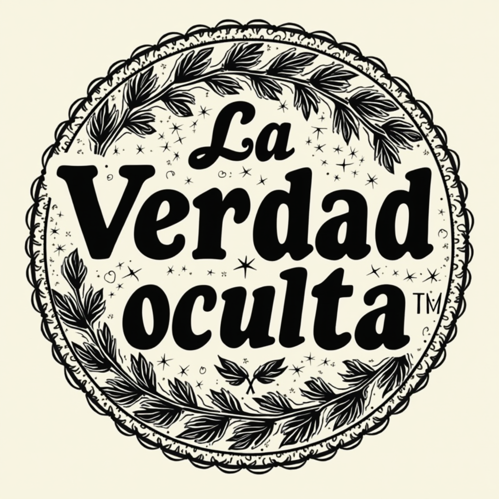
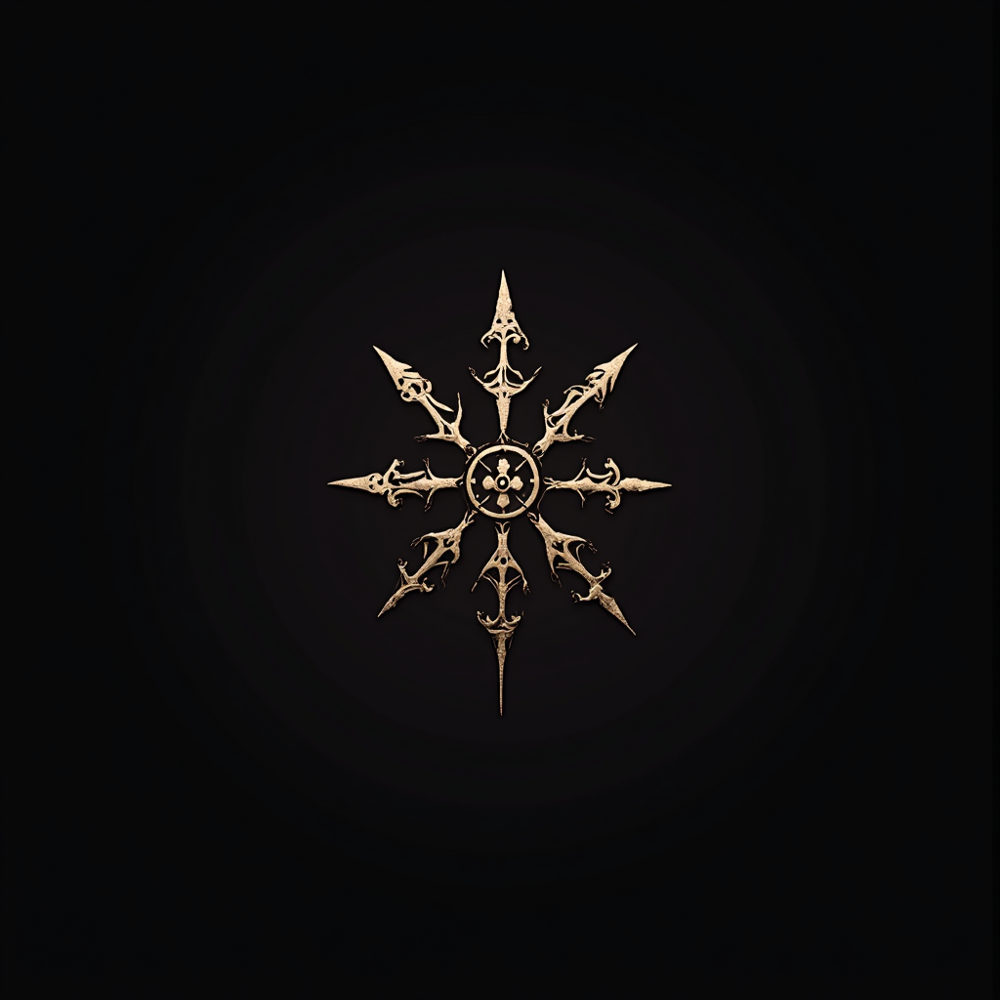
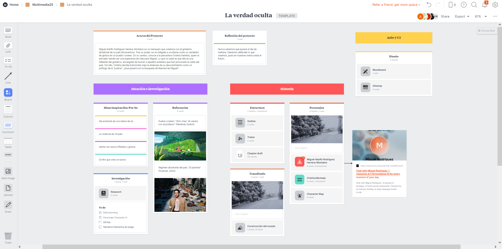

# La verdad oculta

(Plantilla para la creación de un proyecto Multimedia Interactivo)

Proyecto de [Creación Multimedia y Periodismo Multiplataforma](https://github.com/mgea/PeriodismoMultimedia)  
[Master de Nuevos medios interactivos y periodismo multimedia](https://masteres.ugr.es/newmedia-periodismo-multimedia/)  
Facultad de Comunicación y Documentación  
Univesidad de Granada  

----

**Titulo**: La verdad oculta

**Autor(es)**: Lucía Martín Gómez y Julio Gerardo Hun Longchong

**Resumen**: Miguel Adolfo Rodríguez Herrera-Montalvo es un banquero que colabora con el gobierno dictatorial de su país. Tras su derrocamiento, se ve obligado a ocultarse como un vendedor de globos en un pueblo costero. En su camino, conoce a la pescadora Cristina Ramírez, quien al principio resulta ser una esperanza de vida para Miguel. Lo que no sabe es que ella es una militante del gobierno, encargada de buscar a aquellos exiliados que han provocado la caída del país. Por ello, Cristina decide traicionarlo bajo la amenaza de su descubrimiento como un prófugo de la "justicia". ¿Qué pasará con la búsqueda de libertad de Miguel?

**Logotipo**: 

**Slogan**: Nunca sabemos qué pasará el día de mañana. En nuestras manos está el futuro.

**Hashtag**: #LaVerdadOculta

**Licencia**: hemos utilizado la licencia "Reconocimiento - No Comercial - Sin Obra Derivada (by-nc-nd)" de Creative Commons. Esta licencia no permite la generación de obras derivadas ni hacer un uso comercial de la obra original, es decir, sólo son posibles los usos y finalidades que no tengan carácter comercial.
[img](Creative Commons.png)

**Fecha**: 2025

**Medios** (donde se tiene presencia): 

* Redes sociales: promoción. @LaVerdadOculta
* :octocat: (github url) 
* ArcWeave:
* Protopie:

--- 

### Metodología

Metodología de desarrollo: Diseño de contenidos digitales mediante estrategia de diseño de Experiencias de usuario (UX experiences) 

### Etapa 1: Ideación de proyecto 

En primer lugar, las ideas fueron seleccionadas a partir de un "brainstorming" que hicimos el primer día de clase. En un total de 4 post-its, relacionamos las ideas para crear una narrativa interesante y viable centrado en la Experiencia de Usuario (UX). La idea principal de nuestra historia se concentra en un gobierno dictatorial, donde se plantea un dilema moral: luchar por tus ideales políticos o ser dominado por la fuerza de la élite. En algunas ocasiones esto se ha producido en la vida real, otorgando un toque realista al proyecto.
Posteriormente, plasmamos todo esto en la plataforma Milanote para tener una visión conjunta de lo que queríamos hacer. Las ideas definitivas han sido representadas en esta página, GitHub.

**Investigación de campo**

Nos hemos inspirado en las siguientes propuestas:
* Videojuego "Shin chan: Mi verano con el profesor" (Nintendo Switch): lo hemos cogido para la representación del pueblo costero en el que habita nuestro protagonista Miguel. Es un reflejo del futuro y, a la vez, recuerdos del pasado.
* Película "El pianista" (Polanski, 2002): hemos seleccionado esta obra audiovisual para plasmar lo que ocurre cuando un régimen dictatorial se apodera en un país.

**Necesidad/oportunidad** 

Creemos que es importante hablar de estas temáticas en la actualidad para que no caigan en el olvido de la memoria colectiva. A través de una narrativa interactiva, el usuario podrá aprender las características que sumergen a un país en dictadura para aprender y evitar que vuelvan a suceder.

**Motivación de la propuesta**

Con este proyecto hemos aprendido a desarrollar narrativas interactivas, donde se explota al máximo la Experiencia de Usuario. Consideramos interesante esta propuesta de proyecto ya que, a partir de ella, podemos llevar a cabo obras más ambiciosas en el futuro.

**Personas/Usuarios** 

Este proyecto va dirigido a una audiencia mayor de 16 años, pues la situación ficticia que tratamos les puede ser útil a nivel educativo. Para ello, nos basamos en cierta forma sobre hechos que han sucedido a lo largo de la historia, pero con un lenguaje no demasiado complejo. Este público objetivo podrá disfrutar de un proyecto donde aprenderán los orígenes de una dictadura y sus características.

**Estilo de narración**  (...indica como se hace uso de los medios) 

* Las redes sociales se utilizan para promocionar el proyecto, invitando a todos aquellos que deseen interactuar en una historia de ficción, pero al mismo tiempo en la propia realidad.
* 

(ejemplos/alternativas) 
* documental interactivo / web doc
* videojuego más complejo

**Inspiración/moodboard**

> (captura de imagen) hecha con miro/milanote o https://excalidraw.com/

### Etapa 2: Prototipar / productos 

(Productos que has desarrollado y como se plantea la integración de los diferentes medios, pon los que uses) 

* Imagen visual: la portada ha sido realizada con la herramienta de Inteligencia Artificial "Krea AI". El diseño de la interfaz ha sido más complejo, por lo que se han usado más herramientas.

* Personajes y escenarios: para la creación de los personajes, ha sido fundamental el recurso "Character AI", donde se puede dialogar con los personajes a través de la Inteligencia Artificial. El mismo proceso también ha sido utilizado para los escenarios, resultando ser una herramienta relevante en el proyecto.

* Redes sociales (...) 

* publicidad: banner (... ) 

* ...

### Etapa 3: Técnicas de evaluación utilizadas

(Estrategia que plantearías para evaluar tu propuesta, medidodes e indicadores de éxito, elige / propone) 

* Test con usuarios (...) 
* ... 

### Conclusiones y trabajo futuro

* Gracias a este trabajo, hemos adquirido la capacidad de elaborar narrativas interactivas para crear Experiencias de Usuario lo más inmersivas posibles. El grado de consecución del proyecto ha ido creciendo progresivamente, pues el principio fue aprender los conocimientos básicos y, posteriormente, las herramientas intuitivas que faciliten la creación de esta narrativa.
* Uno de los problemas identificados fue la creación del protagonista Miguel con Inteligencia Artificial. Le dimos muchas vueltas a Krea AI para establecer un diálogo con el personaje que incidiera en la trama de forma directa.

* Grado de consecución del proyecto 
* Problemas identificados  (técnicos / sobre la idea inicial / planificacion… ) 
* Propuestas de mejora (por qué consideras que merece la pena continuar)
* Posible interés del proyecto (¿ Quien podría  colaborar / involucrarse en el proyecto? ¿viable?)

Referencias y recursos: 

* Artículos ..  
* Productos utilizados  
* Propuestas de me

(...)

----

**Referencias y recursos utilizados** :

* [Proceso UX](https://uxmastery.com/resources/process/)
* [Diseño de Experiencias UX](http://www.nosolousabilidad.com/articulos/uxd.htm) 
* [Métodos UX](https://mgea.github.io/UX-DIU-Checklist/index.html) 
* (...) 

 , 2025

[Facultad de Comunicación y Documentación](http://fcd.ugr.es)

Universidad de Granada

