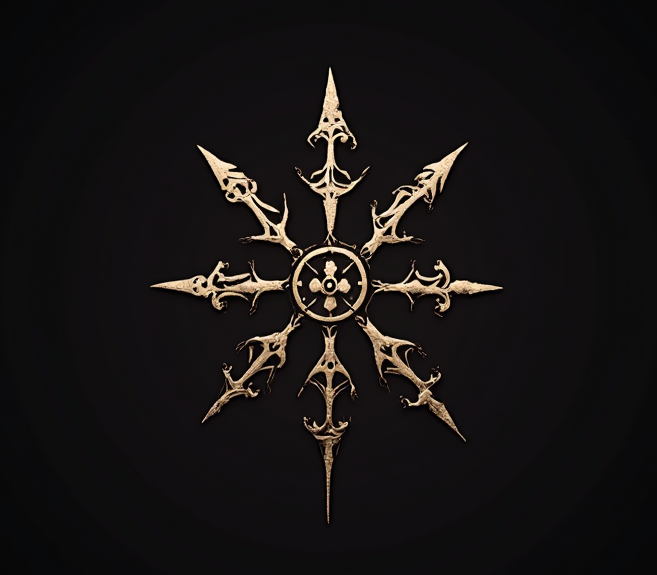

# La verdad oculta

Proyecto de [Creación Multimedia y Periodismo Multiplataforma](https://github.com/mgea/PeriodismoMultimedia)  
[Master de Nuevos medios interactivos y periodismo multimedia](https://masteres.ugr.es/newmedia-periodismo-multimedia/)  
Facultad de Comunicación y Documentación  
Univesidad de Granada  

----

**Titulo**: *La verdad oculta*

**Autor(es)**: Lucía Martín Gómez y Julio Gerardo Hun Longchong

**Resumen**: Miguel Adolfo Rodríguez Herrera-Montalvo es un banquero que colabora con el gobierno dictatorial de su país. Tras su derrocamiento, se ve obligado a ocultarse como un vendedor de globos en un pueblo costero. En su camino, conoce a la pescadora Cristina Ramírez, quien al principio resulta ser una esperanza de vida para Miguel. Lo que no sabe es que ella es una militante del gobierno, encargada de buscar a aquellos exiliados que han provocado la caída del país. Por ello, Cristina decide traicionarlo bajo la amenaza de su descubrimiento como un prófugo de la "justicia". ¿Qué pasará con la búsqueda de libertad de Miguel?

**Logotipo**: 

**Slogan**: *Nunca sabemos qué pasará el día de mañana. Debemos defender lo que creemos, pues en nuestras manos está el futuro.*

**Hashtag**: #LaVerdadOculta

**Licencia**: hemos utilizado la licencia "Reconocimiento - No Comercial - Sin Obra Derivada (by-nc-nd)" de Creative Commons. Esta licencia se caracteriza por no permitir la generación de obras derivadas ni hacer un uso comercial de la obra original. En otras palabras, sólo son posibles los usos y finalidades que no tengan carácter comercial. Se ha elegido esta licencia ya que nuestro proyecto es original y lo queremos llevar a cabo en un futuro, por lo que deseamos mantener los derechos comerciales de nuestra obra.

**Fecha**: 2025

**Medios** (donde se tiene presencia): 

* Redes sociales: promoción. @LaVerdadOculta
* GitHub: https://github.com/Luciamusica/Luciamusica.github.io/tree/master
* ArcWeave:
* Protopie:

--- 

### Metodología

Metodología de desarrollo: Diseño de contenidos digitales mediante estrategia de diseño de Experiencias de usuario (UX experiences) 

### Etapa 1: Ideación de proyecto 

En primer lugar, las ideas fueron seleccionadas a partir de un "brainstorming" que hicimos el primer día de clase. En un total de 4 post-its, relacionamos las ideas para crear una narrativa interesante y viable centrado en la Experiencia de Usuario (UX). La idea principal de nuestra historia se concentra en un gobierno dictatorial, donde se plantea un dilema moral: luchar por tus ideales políticos o ser dominado por la fuerza de la élite. En algunas ocasiones esto se ha producido en la vida real, otorgando un toque realista al proyecto.
Posteriormente, plasmamos todo esto en la plataforma Milanote para tener una visión conjunta de lo que queríamos hacer. Las ideas definitivas han sido representadas en esta página, GitHub.

**Investigación de campo**

Nos hemos inspirado en las siguientes propuestas:
* Videojuego "Shin chan: Mi verano con el profesor" (Nintendo Switch): lo hemos cogido para la representación del pueblo costero en el que habita nuestro protagonista Miguel. Es un reflejo del futuro y, a la vez, recuerdos del pasado.
* Película "El pianista" (Polanski, 2002): hemos seleccionado esta obra audiovisual para plasmar lo que ocurre cuando un régimen dictatorial se apodera en un país.

**Necesidad/oportunidad** 

Creemos que es importante hablar de estas temáticas en la actualidad para que no caigan en el olvido de la memoria colectiva. A través de una narrativa interactiva, el usuario podrá aprender las características que sumergen a un país en dictadura para aprender y evitar que vuelvan a suceder. Además, ponemos en práctica esto a modo de juego, pues creemos que se crean pocas narrativas lúdicas en la actualidad. 

**Motivación de la propuesta**

Con este proyecto hemos aprendido a desarrollar narrativas interactivas, donde se explota al máximo la Experiencia de Usuario. Consideramos interesante esta propuesta de proyecto ya que, a partir de ella, podemos llevar a cabo obras más ambiciosas en el futuro.

**Personas/Usuarios** 

Este proyecto va dirigido a una audiencia mayor de 16 años, pues la situación ficticia que tratamos les puede ser útil a nivel educativo. Para ello, nos basamos en cierta forma sobre hechos que han sucedido a lo largo de la historia, pero con un lenguaje no demasiado complejo. Este público objetivo podrá disfrutar de un proyecto donde aprenderán los orígenes de una dictadura y sus características.

**Estilo de narración**  (...indica como se hace uso de los medios) 

* Las redes sociales se utilizan para promocionar el proyecto, invitando a todos aquellos que deseen interactuar en una historia de ficción, pero al mismo tiempo en la propia realidad.
* Narrativa interactiva en juego: el usuario puede navegar a través del videojuego por las etiquetas, conociendo la trama. Así, la UX se define en nuestro proyecto como la exploración e interacción con los elementos.

Ejemplo:
* Videojuego más ambicioso con recursos más complejos

Alternativa 
* Documental interactivo / web doc

**Inspiración/moodboard**

> (Captura de imagen) hecha con Milanote

### Etapa 2: Prototipar / productos 

(Productos que has desarrollado y como se plantea la integración de los diferentes medios, pon los que uses) 

* Imagen visual: la portada (logotipo del proyecto) ha sido realizada con la herramienta de Inteligencia Artificial "Krea AI". El diseño de la interfaz ha sido más complejo, por lo que se han usado otro tipo de herramientas.

* Personajes y escenarios: para la creación de los personajes, ha sido fundamental el recurso "Character AI", donde se puede dialogar con los personajes a través de la Inteligencia Artificial. Para los escenarios se ha utilizado "Krea AI" de nuevo, resultando ser una herramienta relevante en el proyecto.

* Redes sociales: promoción del proyecto donde se publican pistas con el objetivo de que los usuarios empiecen a interactuar. Así, conocemos su feedback desde el principio.

* Publicidad: banner (... ) 

### Etapa 3: Técnicas de evaluación utilizadas

(Estrategia que plantearías para evaluar tu propuesta, medidodes e indicadores de éxito, elige / propone) 

* Test de los usuarios: los "testers" nos indicarán su feedback acerca de la narrativa y el grado de interacción, así como la visualización y comprensión de la historia desde el proceso de desarrollo del proyecto.
* Preguntas en plataformas: el proyecto estará vinculado a hilos de la cuenta del proyecto en redes sociales. Aquí se realizarán preguntas abiertas a los usuarios en relación a la trama, con el objetivo de conocer si se aproximan o no a la idea central. En el caso contrario, podremos modificar los elementos narrativos del proyecto. Esto da lugar a la transmedialidad.
* Simulaciones de diálogo: al final de nuestro proyecto se podría realizar una simulación de diálogo con Inteligencia Artificial para seguir fomentando la interacción en la narrativa.
* Encuestas online: una vez que los usuarios lleguen al final del proyecto, realizaremos una encuesta para conocer si les ha gustado o no, y qué se podría mejorar en relación a proyectos futuros.

### Conclusiones y trabajo futuro

* Gracias a este trabajo, hemos adquirido la capacidad de elaborar narrativas interactivas para crear Experiencias de Usuario lo más inmersivas posibles. El grado de consecución del proyecto ha ido creciendo progresivamente, pues el principio fue aprender los conocimientos básicos y, posteriormente, las herramientas intuitivas que faciliten la creación de esta narrativa.
* Uno de los problemas identificados fue la relación de las ideas para crear la historia. Tomamos Inteligencias Artificial como ChatGPT y Deepseek para que nos ayudaran a vincular las ideas de los pos-its (mencionados anteriormente). Ambas proporcionaban ideas diferentes, por lo que decidimos seleccionar cuestiones de ambas para generar una narrativa lo más coherente y realista posible que incorporara la interacción en el jugador. Por otro lado, también tuvimos problemas con la creación técnica del protagonista Miguel con Inteligencia Artificial. Le dimos muchas vueltas a Krea AI para establecer un diálogo con el personaje que incidiera en la trama de forma directa, consiguiendo finalmente un personaje sobre el que el usuario puede extraer información sobre la historia.
* Consideramos que merece la pena continuar ya que la Experiencia de Usuario es un mercado relativamente reciente, por lo que creemos que se debe tener en cuenta a la hora de generar historias donde el usuario sea el punto central sobre la interacción en la narrativa.
* El interés del proyecto es la colaboración con instituciones educativas para fomentar el aprendizaje de este tipo de contenidos, por lo que pretendemos que se involucren los Ministerios nacionales y las comunidades autónomas de los países tanto de España como de Latinoamérica. En este sentido, sí sería un proyecto viable.

Referencias y recursos: 

* Artículos ..  
* Productos utilizados  
* Propuestas de me

(...)

----

**Referencias y recursos utilizados** :

* [Proceso UX](https://uxmastery.com/resources/process/)
* [Diseño de Experiencias UX](http://www.nosolousabilidad.com/articulos/uxd.htm) 
* [Métodos UX](https://mgea.github.io/UX-DIU-Checklist/index.html) 
* (...) 

 , 2025

[Facultad de Comunicación y Documentación](http://fcd.ugr.es)

Universidad de Granada

